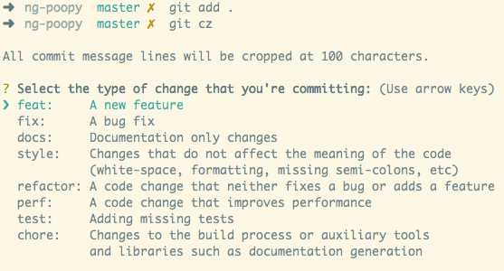
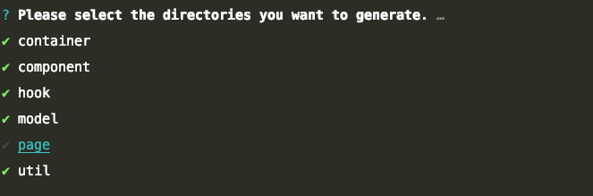
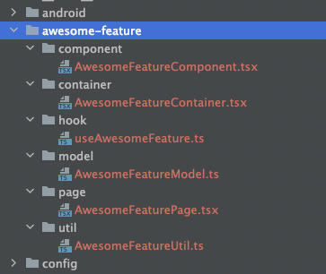

<!-- Space: PHP -->
<!-- Title: React Native CLI for MM Projects -->
<!-- Attachment: ./assets/commitizen.png -->
<!-- Attachment: ./assets/generated_feature.png -->
<!-- Attachment: ./assets/select_feature_folders.png -->

<!-- Include: disclaimer.md -->
# mm-rn-cli CLI
[](http://commitizen.github.io/cz-cli/)

The CLI facilitates the process of starting a new React Native project from scratch.
When starting a new project with `mm-rn-cli` it automatically installs and sets up the following:
- React
- React Native
- TypeScript
- React Navigation - read more [here](#Navigation)
- Styles(optional) - styled-components vs Stylesheet - read more [here](#Styles)
- Redux State management(optional) - read more [here](#State-Management)
- Jest - unit test setup, threshold for coverage - read more [here](#Testing)
- Predefined environments - read more [here](#Environments)
- Husky Hooks - read more [here](#Husky)
- Commits linter - commitlint and commitizen - read more [here](#Commits)
- Predefined eslint and prettier rules

## Installation
// TODO

## Usage
Create a new project using `start-project` and mandatory options for `Folder Name` and `App Bundle Id`

```
mm-rn-cli start-project awesomeApp com.awesomeapp
```
Note that bundle ID should follow proper format (for details check `BUNDLE_ID_REGEX` in `constants.ts`) or an Error will be thrown.

Pick the styling library - Styled Components or built-in StyleSheet:
```
? Please select a styling library … 
❯ Styled Components
  React-Native built-in StyleSheet
```

Pick the state management library - Redux Toolkit or No State Management
```
? Please select a state management library … 
❯ Redux Toolkit
  No State Management
```

In case you want to add react navigation example code in the project:
```
? React Navigation: … 
❯ With set-up and example screens.
  Without examples.
```

#### `Styles`
- `Styled Components` option - when selected `styled-components` library is automatically installed and 
  basic usage code examples are added in `baseProject/src/features/home/components/HomeComponent.tsx`
  
  If `React-Native built-in StyleSheet` option is picked the application will use the default StyleSheet functionality:
  ```
  const styles = StyleSheet.create({
    container: {
      ...options
    }
  });
  ```

#### `State Management`
- `Redux Toolkit` option - when selected `react-redux` library will be automatically installed. 
  `src/store/store.ts` will be imported in App.tsx. The file contains basic store setup including redux toolkit.
  `src/store/hooks.ts` is also available with predefined setup for easy usage of useDispatch and useSelector.
  
#### `Navigation`
- `With set-up and example screens` option - when selected the App will automatically include example BottomTabNavigator 
  (`src/common/navigation/bottomTab/BottomTabNavigator.tsx`)


#### `Testing`
- The script will install `jest` and setup jest config for coverage threshold

#### `Environments`
- In order to handle different environments the CLI will install `react-native-config` library and include dev, stage and production environment files.

#### `Husky`
- Husky hooks are to be used in order to automate some processes:
  - commit-msg - will trigger validation on the commit message enforcing writing proper commit messages.
  - pre-commit - will run linters and TypeScript check against staged files. It will also check for circular dependencies among the project.
  - pre-push - will run all tests and fail if any of them fail or the coverage threshold is not met.

#### `Commits`
- The CLI enforces usage of proper commit messages using commitlint and commitizen. Commitizen will guide you through a friendly CLI when git commit command is used:
  


  It is all about using [Conventional Commits](https://www.conventionalcommits.org/en/v1.0.0/) 


### `Generator Commands:`
- Container:
  `mm-rn-cli generate container FileNameContainer`
  Filename **must** end with *Container* keyword.
  If a container folder doesn't exist, you will be asked if it should be created.

- Component:
  `mm-rn-cli generate component FileNameComponent`
  Filename **must** end with *Component* keyword.
  If a container folder doesn't exist, you will be asked if it should be created.

- Hook:
  `mm-rn-cli generate hook useMyHookName`
  Filename follows "useYourHookName" convention.

- Model:
  `mm-rn-cli generate model ModelFile`

- Page:
  `mm-rn-cli generate page FileNamePage`
  Filename **must** end with *Page* keyword.

- Util:
  `mm-rn-cli generate util FileNameUtil`

- Test:
  `mm-rn-cli generate test FileName`
  File **must** be placed inside a container, component, hook, model, page or util folder.

- Feature:
  `mm-rn-cli generate feature awesome-feature`
  Feature name should start with lowercase character.
  

  As a result, a new set of feature components will be added to the project:
  


## Development

- To run the cli locally, first link the package. Run the following command inside the repository:
```
yarn link
```

Then you can test the cli on your machine.

## Customizing your CLI

Check out the documentation at https://github.com/infinitered/gluegun/tree/master/docs

## Publishing to NPM

To package your CLI up for NPM, do this:

```shell
$ npm login
$ npm whoami
$ npm lint
$ npm test
(if typescript, run `npm run build` here)
$ npm publish
```

## Updating confluence documentation
This project has its own [confluence page][confluence] which is automatically updated using [kovetskiy/mark][mark] tool


# License

MM-RN-CLI is MIT licensed, as found in the [LICENSE][license] file.

[license]: ./LICENSE
[mark]: https://github.com/kovetskiy/mark
[confluence]: https://mentormate.atlassian.net/wiki/spaces/PHP/pages/3709403152/React+Native+CLI+for+MM+Projects
